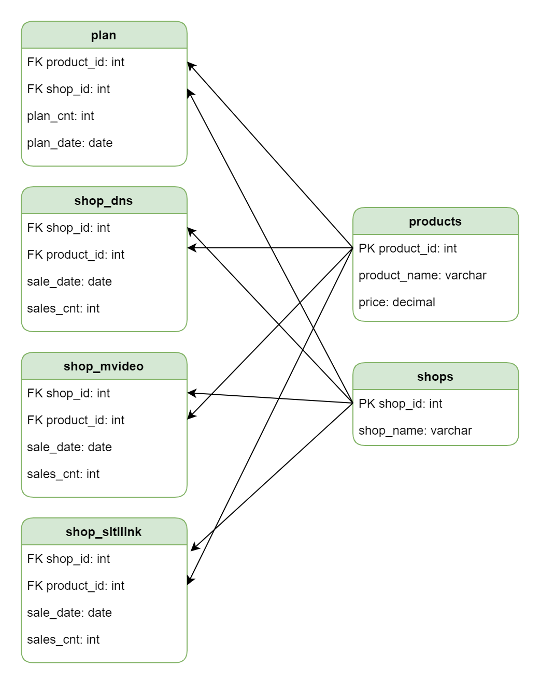
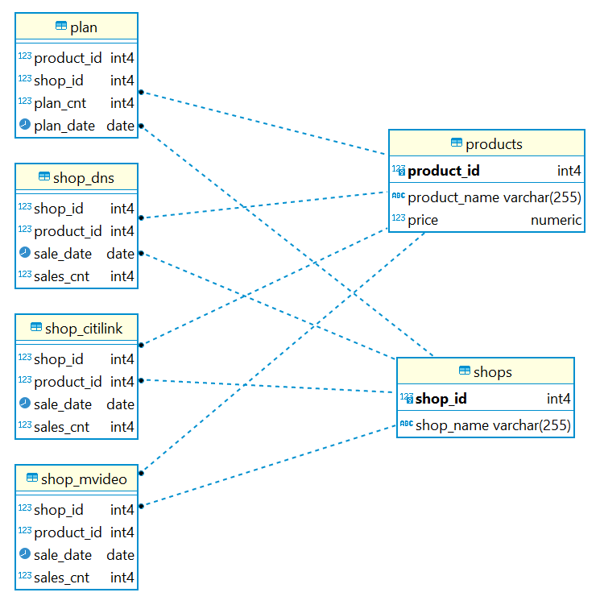

# Тема 2.4 "Введение в DWH".
# Задание 1. 
```
Вам выпала редкая возможность — помочь аналитикам оценить эффективность планирования продаж линейки отечественных смартфонов. Линейка насчитывает целых 3 модели: «Испорченный телефон», «Сарафанное радио» и «Патефон». Вы неплохого прокачали ваших аналитиков в SQL, и они даже смогли соорудить подобную конструкцию (см. выше). Однако она не лишена недостатков — в ней отсутствует одна важная связующая деталь (таблица). Добавить недостающую деталь будет вашим первым заданием.
```

## Логическая структура базы данных:



## Графическая структура базы данных:



# Задание 2. 
```
После того как схема приобретет законченный вид, вам необходимо решить главную задачу — собрать вашу первую витрину! Как уже изначально было озвучено, аналитикам нужно оценить, насколько отдел планирования хорошо делает свою работу. Для этого вам необходимо разработать SQL-скрипт, который формирует таблицу со следующим набором атрибутов:

- shop_name — название магазина,
- product_name — название товара,
- sales_fact — количество фактических продаж на конец месяца,
- sales_plan — количество запланированных продаж на конец месяца,
- sales_fact/sales_plan — отношение количества фактических продаже к запланированному,
- income_fact — фактический доход,
- income_plan — планируемый доход,
- income_fact/income_plan — отношение фактического дохода к запланированному.
```

### 1. SQL-скрипт для создания таблиц:
Файл: [DDL-script](sql_scripts/ddl/1_ddl.sql)

### 2. SQL-скрипт для заполения таблиц:
Файл: [DML-script](sql_scripts/dml/2_dml.sql)

### 3. SQL-запросник - скрипт с решением задач:
Файл: [Queries-script](sql_scripts/queries.sql)

### 4. Файл Docker-compose:
Файл: [Docker-compose](docker-compose.yml)


### Для развертывания базы "Планирование продаж" необходимо:
1. Скачать архив из репозитория;
2. Распаковать в нужную папку;
3. В терминале перейти в папку с базой данных и выполнить команду ***docker-compose up -d***.
4. Запустить DBeaver, port 5435, наименование базы данных (sales_planning), логин (postgres), пароль(password)
5. Посмотреть результаты отработанного скрипта queries.sql можно в DBeaver'е, запустив каждую задачу последовательно, или посмотреть логи командой: ***docker logs library***.